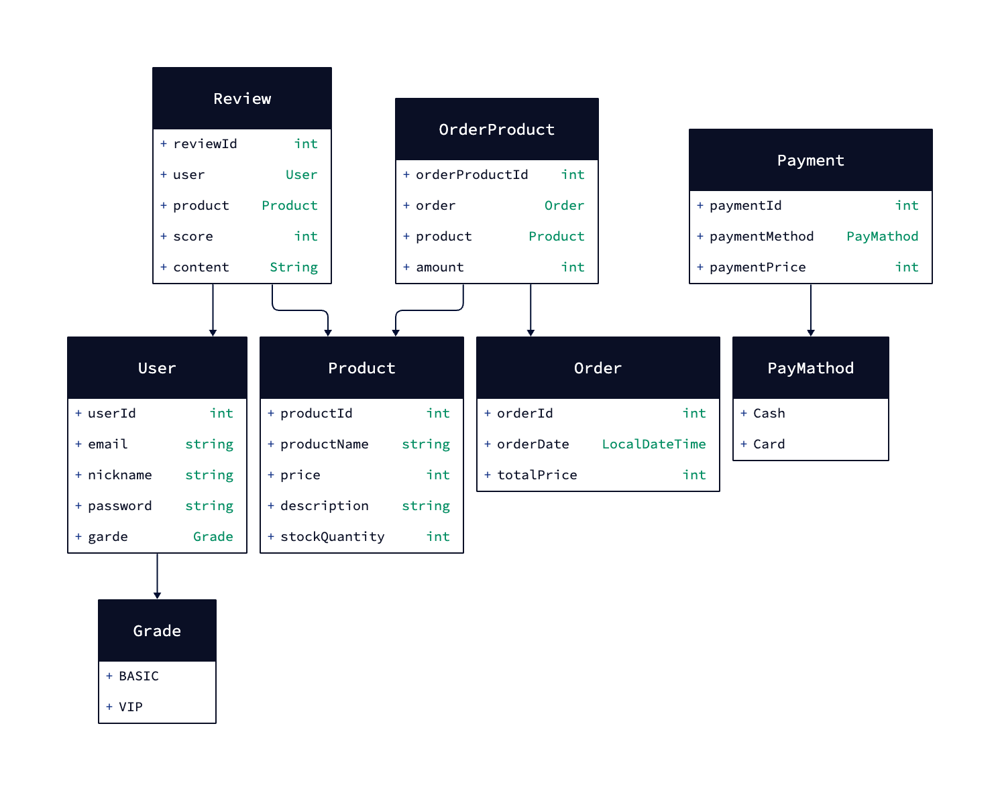

## 🎬 순수 자바만 사용하는 미니 애플리케이션 :)
> BEM : 이 프로젝트는 순수 자바만을 활용하는 미니 애플리케이션 개발로 시작합니다. 자바의 기본부터 중급 수준의 문법을 학습하면서 객체지향 프로그래밍(OOP)을 적극적으로 활용합니다. GUI 없이 커맨드 라인만을 활용하여 작은 미니 쇼핑몰 애플리케이션을 만들어 나가는 과정을 학습합니다.

### Tools
- JDK 17 version (correto)
- Intellij Ultimate
- Gradle
- ...

---

### Mentor

- @[Thingk0](https://github.com/thingk0)

### Mentee

- @[inyouzg](https://github.com/inyouzg)
- @[mlngwan](https://github.com/mlngwan)
- @[JuneBori](https://github.com/JuneBori)
- @[Kim juhye](https://github.com/itworksforwhat)

---

### UML

먼저, **클래스 다이어그램**을 설계해 보겠습니다. 이 다이어그램은 시스템의 구조적인 측면을 나타내며, 주요 클래스들과 그들 간의 관계를 보여줍니다. 작은 쇼핑몰 서비스의 경우, 다음과 같은 클래스들을 고려할 수 있습니다:

 

1. **User**: 사용자를 나타내는 클래스로, 일반 사용자와 관리자를 포함.
    - 속성: 사용자ID, 이름, 이메일, 비밀번호 등
    - 메서드: 로그인, 로그아웃 등

2. **Product**: 상품을 나타내는 클래스.
    - 속성: 제품ID, 이름, 가격, 설명, 재고량 등
    - 메서드: 재고 확인, 제품 정보 업데이트 등

3. **Order**: 주문을 나타내는 클래스.
    - 속성: 주문ID, 주문 날짜, 총액 등
    - 메서드: 주문 생성, 주문 상태 업데이트 등

4. **Payment**: 결제를 나타내는 클래스.
    - 속성: 결제ID, 결제 방식, 결제 금액 등
    - 메서드: 결제 처리 등

5. **Review**: 제품 리뷰를 나타내는 클래스.
    - 속성: 리뷰ID, 사용자ID, 제품ID, 평점, 리뷰 내용 등
    - 메서드: 리뷰 작성, 리뷰 수정 등

 

이제, **유스케이스 다이어그램**을 설계해 보겠습니다. 이 다이어그램은 시스템을 사용하는 다양한 사용자(액터)의 관점에서 시스템의 기능을 나타냅니다. 일반적인 쇼핑몰 서비스의 경우, 다음과 같은 주요 유스케이스를 고려할 수 있습니다:

1. **사용자 등록 및 관리**: 사용자가 시스템에 등록하고 자신의 계정을 관리할 수 있습니다.
2. **제품 검색 및 조회**: 사용자가 제품을 검색하고 상세 정보를 볼 수 있습니다.
3. **주문 생성 및 관리**: 사용자가 제품을 주문하고 주문 상태를 확인할 수 있습니다.
4. **결제 처리**: 사용자가 주문한 제품에 대해 결제를 진행합니다.
5. **리뷰 작성 및 조회**: 사용자가 제품에 대한 리뷰를 작성하고 다른 사용자의 리뷰를 볼 수 있습니다.

### MiniApps UML V1

[프로젝트 UML](https://play.d2lang.com/?script=dFLRbuIwEHzfr5gfuB_ww0l3nHRCKm1a2r6v7BVYEBvZThGq-PfKdsABhafYs5Pd8ex8RAkK3wQULQrFWiJgiBKWRsG6RID0bPcKMQXrNgQ4q3eOe5lAB47x6IOZQBsORhT-BzZCZ6IueDPoND_wUItt5gg8340JVsuFkvce7CFvfUKJyevd68Au2XSq1DPRS47DYwWAnxCaioIqlL-bKIWRSAD3fnDpds7jAXed_3EShSeveZ-P77YXApJPvO_aS7N3fOrFPfKuFifeVWAlaeuNQsenFedjK912f5MvK8f55qHUWu-hZCYnZ96PqH24bkh7l4rsdd3OmajEYdagv3_WywUBn8tufHJVPUtecNyWTzDtBfj1uypr14uwDOd7TeNoZyFczZlGJFfq0u_RS8OfAAAA__8%3D&layout=elk&sketch=0&theme=8&)
***